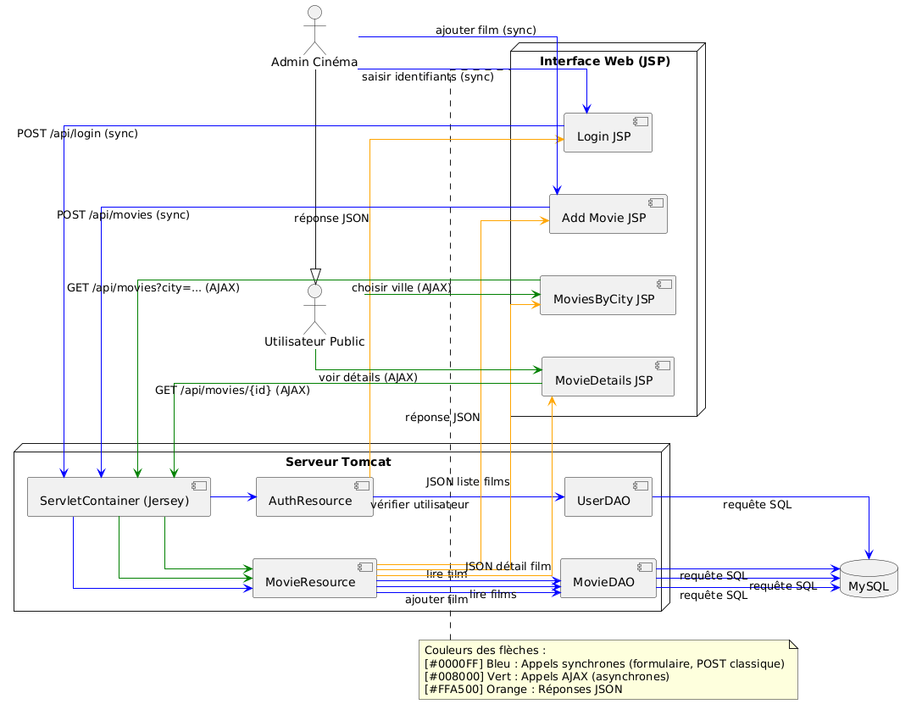
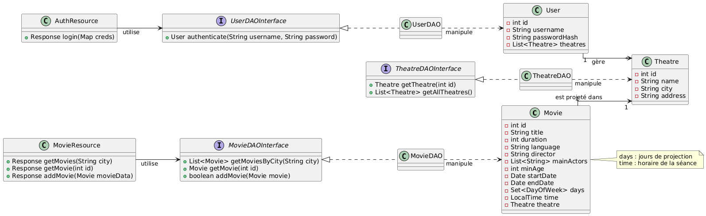

# MovieParisApp – Application Web de gestion de films (Paris)
<br>

## 🎬 Présentation du projet
**MovieParisApp** est une application web (**Java EE**) qui offre des services REST pour gérer la programmation de films dans les cinémas parisiens, à l’image du site AlloCiné.

<details>
<summary>🛠️ Fonctionnalités principales</summary>

- **Administrateurs (cinémas)** :
  - Se connecter.
  - Ajouter de nouveaux films avec :
    - Titre.
    - Durée.
    - Langue.
    - Sous-titres éventuels.
    - Réalisateur.
    - Acteurs principaux.
    - Âge minimum.
    - Plage de diffusion (dates, jours, horaires).
    - Ville (adresse du cinéma).

- **Utilisateurs publics** :
  - Accès libre (sans login).
  - Liste des films par ville.
  - Consultation du détail de chaque film (synopsis, horaires, cinéma, etc.).

</details>


<details>
<summary>⚙️ Technologies utilisées</summary>

- **Backend** :
  - Java EE.
  - **JAX-RS (Jersey)** pour les services REST.
  - **Jackson** pour la sérialisation JSON.
  - Déploiement sur **Tomcat**.

- **Base de données** :
  - **MySQL**.

- **Frontend** :
  - **JSP/HTML** pour l’interface utilisateur.

- **Build & Déploiement** :
  - **Maven** (packaging WAR).
  - Gestion des dépendances.
  - Préparé pour intégration continue.

</details>


<br>

## 🏗️ Architecture du système
L’architecture suit un modèle **MVC** classique, organisé en trois couches principales :
1. **Interface Web (JSP)** — Vue.
2. **Services REST (JAX-RS / Jersey)** — Contrôleur.
3. **Base de données MySQL + DAO** — Modèle.
<details>
<summary>🖥️ Interface Web (JSP)</summary>

- Les **administrateurs cinéma** interagissent via des pages JSP (*login*, *ajout de film*).
  - Ces pages envoient des requêtes HTTP **synchrones** vers les endpoints REST (exemple : `POST /api/login`).
- Les **utilisateurs publics** accèdent à des JSP (*liste des films*, *détails*).
  - Ces pages déclenchent des appels REST soit **asynchrones (AJAX)**, soit côté serveur (**server-side**), pour récupérer les données.

</details>

<details>
<summary>🔧 Backend REST (JAX-RS via Jersey)</summary>

- Les requêtes HTTP sont interceptées par le **ServletContainer Jersey**.
- Jersey achemine les requêtes vers les classes Java **annotées** (`@Path`, `@GET`, `@POST`, etc.).
- Configuration dans `web.xml` :
  - Déclaration du servlet Jersey.
  - Package à scanner pour les ressources REST.
  - Mapping des URL sur le motif `/api/*`.

</details>

<details>
<summary>🗄️ Accès aux données (DAO / MySQL)</summary>

- Les ressources REST appellent la **couche DAO** :
  - Vérification des identifiants (`UserDAO`).
  - Lecture / écriture de films (`MovieDAO`).
- La DAO effectue les requêtes SQL sur MySQL.
- Les résultats sont renvoyés en JSON (*Jackson*).

</details>

<details>
<summary>🔄 Flux général</summary>

1. Le navigateur charge les pages JSP.
2. Les JSP initient des appels REST.
3. Jersey dirige les requêtes vers les ressources REST.
4. Les DAO accèdent à MySQL.
5. Les réponses JSON sont renvoyées aux JSP.

</details>

<details>
<summary>✅ Résumé du découpage</summary>

| Couche | Rôle |
|--------|------|
| **JSP** | Vue (interface utilisateur) |
| **REST (Jersey)** | Contrôleur |
| **DAO + MySQL** | Modèle |

</details>

<details>
<summary>⚠ Remarque sur les rôles Admin / Public</summary>

- **Admin** dispose des mêmes capacités que Public, avec des privilèges supplémentaires (ajout de films).
- Le diagramme reflète cette hiérarchie : `Admin` hérite de `Public`.
</details>

<details>
<summary>📊 🔍 <strong>🖼️ DIAGRAMME D’ARCHITECTURE — CLIQUEZ POUR AFFICHER</strong> 🔍 📊</summary>
  

</details>


<br>

## 📁 Arborescence du projet

Le projet Maven est structuré de manière standard pour une application web Java (**packaging WAR**).

<details>
<summary>📂 Voir l’arborescence</summary>

```plaintext
MovieParisApp/
├── README.md                   # Documentation du projet (présentation, diagrammes, endpoints...)
├── pom.xml                     # Fichier Maven (dépendances Jersey, Jackson, MySQL, JUnit...)
├── src/
│   ├── main/
│   │   ├── java/
│   │   │   └── com/movieparisapp/
│   │   │       ├── model/      # Classes métier (modèle de données)
│   │   │       │   ├── Movie.java       # Classe entité Film (POJO)
│   │   │       │   ├── Theatre.java     # Classe entité Cinéma/Salle
│   │   │       │   └── User.java        # Classe entité Utilisateur (admin cinéma)
│   │   │       ├── dao/        # Classes d’accès aux données (JDBC)
│   │   │       │   ├── MovieDAO.java    # DAO pour les films
│   │   │       │   ├── TheatreDAO.java  # DAO pour les salles
│   │   │       │   └── UserDAO.java     # DAO pour les utilisateurs (auth)
│   │   │       └── rest/       # Services REST (JAX-RS Resources)
│   │   │           ├── MovieResource.java   # Endpoints REST /movies
│   │   │           └── AuthResource.java    # Endpoint REST /login
│   │   ├── resources/
│   │   │   ├── db/
│   │   │   │   ├── schema.sql   # Script SQL de création de la base (tables Movie, Theatre, User)
│   │   │   │   └── data.sql     # Script SQL d’insertion de données mock
│   │   │   └── mock/
│   │   │       ├── movies.json   # Données JSON mock des films (pour dev frontend)
│   │   │       ├── theatres.json # Données JSON mock des salles
│   │   │       └── users.json    # Données JSON mock des utilisateurs
│   │   └── webapp/
│   │       ├── WEB-INF/
│   │       │   ├── web.xml      # Descripteur de déploiement (configuration de Jersey, etc.)
│   │       │   └── web.xml      # (Autres configs web, si nécessaires)
│   │       ├── login.jsp        # Page de login admin cinéma
│   │       ├── addMovie.jsp     # Formulaire d’ajout de film
│   │       ├── moviesByCity.jsp # Page publique listant les films d’une ville
│   │       └── movieDetails.jsp # Page publique de détail d’un film
│   └── test/
│       └── java/
│           └── com/movieparisapp/
│               ├── rest/
│               │   └── MovieResourceTest.java   # Tests unitaires des endpoints REST
│               └── dao/
│                   └── MovieDAOTest.java        # Tests unitaires des DAO (ex: MovieDAO)
```
</details>

<details>
<summary>💡 Remarque sur l’organisation des modules</summary>
<br>
L’arborescence est conçue pour que chaque développeur puisse se concentrer sur son module :

- Le développeur **frontend** travaille dans `src/main/webapp` (*JSP + JSON mock*).
- Le développeur **backend REST** travaille dans `src/main/java/com/movieparisapp/rest`.
- Les modules sont isolés pour limiter les interférences.

</details>


<br>

## 📚 Diagramme de classes (modèle Java)

Le diagramme de classes UML ci-dessous présente les principales classes Java du projet et leurs relations.


<details>
  
<summary>📝 Description du modèle</summary>

Dans ce modèle :

- La classe **Movie** est liée à un **Theatre** (chaque film est projeté dans une salle donnée).
- Chaque **User** possède un attribut `role` qui détermine s’il s’agit d’un **utilisateur public** (lecture seule) ou d’un **administrateur** (peut gérer des cinémas et des films).
  - Les administrateurs (`role = admin`) peuvent être associés à plusieurs cinémas qu’ils gèrent.
- Les classes **DAO** (Data Access Object) sont définies par des interfaces (`MovieDAOInterface`, `TheatreDAOInterface`, `UserDAOInterface`) et implémentées par des classes concrètes.
  - Elles fournissent des méthodes pour interagir avec la base de données (par exemple : récupérer les films par ville, ajouter un film).
- Les classes **Resource** (**MovieResource**, **AuthResource**) exposent les endpoints REST et utilisent les DAO pour la logique métier.
  - Par exemple, `MovieResource.getMovies(city)` appelle `MovieDAO.getMoviesByCity(city)` et renvoie la liste des films au format JSON.
  
Le diagramme respecte la séparation des responsabilités :
- **Modèle (données)** : `Movie`, `Theatre`, `User`.
- **Accès aux données** : DAO (interfaces + implémentations).
- **Exposition REST** : Resources.
</details>

<br>

## 🔗 API REST – Endpoints et formats JSON

Le backend expose quatre endpoints principaux via l’API REST (chemin de contexte `/api/` sur Tomcat).
Toutes les réponses JSON sont produites automatiquement par Jackson à partir des objets Java (POJOs) retournés par les méthodes JAX-RS. Grâce à l’intégration de Jackson avec Jersey, il suffit d’inclure la dépendance appropriée pour que les entités soient sérialisées/désérialisées en JSON. Les méthodes renvoient généralement un objet `Response` JAX-RS ou directement le POJO, Jersey se chargeant d’appliquer la conversion JSON. 

<details>
<summary>🔑 <strong>POST /login – Authentification</strong></summary>

**Description** : Authentification basique d’un cinéma (admin).

**Requête JSON** : JSON contenant les identifiants d’un utilisateur admin de cinéma, par ex:

```json
{ "username": "ugc_admin", "password": "secret" }
```
**Traitement** : vérifie dans la base si un utilisateur avec ce login/mot de passe existe. Si oui, la réponse contient un indicateur de succès (et éventuellement un token de session simple).

**Réponse** : code 200 OK avec JSON, par ex. succès :
```json
{ "success": true, "userId": 1, "message": "Login successful" }
```
(En cas d’échec : `{"success": false, "message": "Invalid credentials"}` et code 401 Unauthorized).
</details>

<details>
<summary>🎞 <strong>POST /movies – Ajout d’un film  (par un admin authentifié)</strong></summary>

**Requête JSON** : JSON représentant le film à ajouter. Ce JSON comprend les métadonnées du film ainsi que la salle/horaire. Par exemple :

```json
{
  "title": "Inception",
  "duration": 148,
  "language": "Anglais (VO sous-titré FR)",
  "director": "Christopher Nolan",
  "mainActors": ["Leonardo DiCaprio", "Ellen Page"],
  "minAge": 12,
  "startDate": "2010-07-16",
  "endDate": "2010-09-30",
  "days": "Lundi,Mercredi,Vendredi",
  "time": "20:00",
  "theatreId": 1
}
```
(Ici `theatreId` identifie la salle où le film sera joué. Dans une implémentation réelle, on associerait le film au cinéma de l’utilisateur authentifié automatiquement, plutôt que de l’envoyer dans le JSON.)

**Traitement** :  crée un nouveau film dans la base de données (après avoir éventuellement vérifié l’authentification de l’appelant). Le DAO insère le film et retourne son ID généré.

**Réponse** : code 201 Created si succès, avec éventuellement le film créé en JSON (incluant son `id` attribué). Par ex.:
```json
{ "success": true, "userId": 1, "message": "Login successful" }
```
</details>


<details> 
  <summary>🎥 <strong>GET /movies?city={ville} – Liste des films par ville</strong></summary>

  **Requête** : paramètre de requête `city` dans l’URL, par ex : `/movies?city=Paris` (Aucune authentification requise).
  
  **Traitement** : interroge la base via `MovieDAO.getMoviesByCity(ville)` pour obtenir tous les films dont la salle est dans la ville spécifiée.
  
  **Réponse** : code 200 OK avec un tableau JSON listant les films. Chaque film inclut ses informations principales. On peut choisir de ne pas tout exposer (par ex. ne pas inclure les horaires détaillés dans la liste), mais pour simplicité on renvoie la structure complète. Exemple de réponse :
  
 ```json
[
  {
    "id": 5,
    "title": "Inception",
    "duration": 148,
    "language": "Anglais (VO sous-titré FR)",
    "director": "Christopher Nolan",
    "mainActors": ["Leonardo DiCaprio", "Elliot Page"],
    "minAge": 12,
    "startDate": "2010-07-16",
    "endDate": "2010-09-30",
    "days": "Lundi,Mercredi,Vendredi",
    "time": "20:00",
    "theatre": {
      "id": 1,
      "name": "UGC Ciné Cité Les Halles",
      "city": "Paris",
      "address": "5 rue du Cinéma, 75001 Paris"
    }
  },
  {
    "id": 6,
    "title": "Titanic",
    "...": "..."
  }
]
``` 

Ici deux films sont retournés pour la ville Paris. L’objet `theatre` imbriqué donne des informations sur le cinéma (on aurait pu n’envoyer que le `theatreId`, mais on affiche le nom et l’adresse pour éviter un aller-retour supplémentaire côté client).
</details>


<details> 
<summary>🎞️ <strong>GET /movies/{id} – Détail d’un film  (accès public)</strong></summary>

**Requête** : l’ID du film dans l’URL (par ex. /movies/5).

**Traitement** : utilise MovieDAO.getMovie(id) pour obtenir le film correspondant (et éventuellement ses informations associées comme la salle).

**Réponse** : code 200 OK avec un objet JSON représentant le film détaillé. Exemple :
```json
{
  "id": 5,
  "title": "Inception",
  "duration": 148,
  "language": "Anglais (VO sous-titré FR)",
  "director": "Christopher Nolan",
  "mainActors": ["Leonardo DiCaprio", "Elliot Page", "Tom Hardy"],
  "minAge": 12,
  "startDate": "2010-07-16",
  "endDate": "2010-09-30",
  "days": "Lundi,Mercredi,Vendredi",
  "time": "20:00",
  "theatre": {
    "id": 1,
    "name": "UGC Ciné Cité Les Halles",
    "city": "Paris",
    "address": "5 rue du Cinéma, 75001 Paris"
  }
}
```
Ce JSON contient tous les détails que l’admin avait fournis lors de l’ajout du film, y compris les informations de salle. Il correspond à ce qui serait affiché sur la page de détail publique.
</details>

<details>
<summary><strong>Exemple d’implémentation — CLIQUEZ POUR AFFICHER</strong> 🔍 📊</summary>

  Le fichier `MovieResource.java` définit les endpoints REST relatifs aux films :
  
  Dans cet exemple simplifié, `MovieDAO` est appelé directement. En pratique, on pourrait ajouter des contrôles d’authentification (par ex., vérifier qu’un utilisateur est bien connecté avant d’accepter l’ajout d’un film). De plus, pour la création de film, le DAO pourrait définir l’ID du film inséré dans l’objet `newMovie` (d’où le `newMovie.getId()` après insertion réussie).
  
```java
@Path("/movies")
@Produces(MediaType.APPLICATION_JSON)
public class MovieResource {

    private MovieDAO movieDao = new MovieDAO();

    @GET
    public Response getMoviesByCity(@QueryParam("city") String city) {
        List<Movie> movies;
        if (city != null && !city.isEmpty()) {
            movies = movieDao.getMoviesByCity(city);
        } else {
            movies = new ArrayList<>();
        }
        return Response.ok(movies).build();
    }

    @GET
    @Path("/{id}")
    public Response getMovieById(@PathParam("id") int id) {
        Movie movie = movieDao.getMovie(id);
        if (movie != null) {
            return Response.ok(movie).build();
        } else {
            return Response.status(Response.Status.NOT_FOUND)
                           .entity("{\"error\":\"Movie not found\"}")
                           .build();
        }
    }

    @POST
    @Consumes(MediaType.APPLICATION_JSON)
    public Response addMovie(Movie newMovie) {
        boolean created = movieDao.addMovie(newMovie);
        if (created) {
            // Retourner l'URI du nouveau film créé, par exemple
            URI uri = URI.create("/movies/" + newMovie.getId());
            return Response.created(uri).entity(newMovie).build();
        } else {
            return Response.status(Response.Status.BAD_REQUEST)
                           .entity("{\"error\":\"Cannot create movie\"}")
                           .build();
        }
    }
}
```

De même, le fichier `AuthResource.java` gère le endpoint `/login` :
Ici, pour simplifier, on renvoie juste un indicateur de succès et l’ID utilisateur en cas de login réussi. Une implémentation plus poussée pourrait créer une session HTTP ou retourner un token JWT que le client devra utiliser lors des appels suivants. Cependant, pour ce projet éducatif, une authentification stateful basique suffit.

```java
@Path("/login")
@Consumes(MediaType.APPLICATION_JSON)
@Produces(MediaType.APPLICATION_JSON)
public class AuthResource {

    private UserDAO userDao = new UserDAO();

    @POST
    public Response login(Map<String, String> credentials) {
        String username = credentials.get("username");
        String password = credentials.get("password");
        User user = userDao.authenticate(username, password);
        if (user != null) {
            // On pourrait générer un token ou créer une session
            return Response.ok("{\"success\":true, \"userId\":"+user.getId()+"}").build();
        } else {
            return Response.status(Response.Status.UNAUTHORIZED)
                           .entity("{\"success\":false, \"message\":\"Invalid credentials\"}")
                           .build();
        }
    }
}
```
</details>

<br>

## 🗄️ Base de données (MySQL)

Le schéma relationnel comprend trois tables : **Movie** (Film), **Theatre** (Cinéma/Salle) et **User** (Utilisateur admin).
Ci-dessous le script SQL de création de ces tables, avec les contraintes clés primaires/étrangères appropriées :


<details>
<summary>📝 <strong>Script de création (schema.sql)</strong></summary>
<br>
  
  **Description des tables** :

- **Theatre** : stocke les salles de cinéma (nom, ville, adresse).

- **User** : comptes admin avec login, mot de passe, et référence vers la salle administrée (`theatre_id`).
Remarque : un utilisateur est associé à un seul cinéma.

- **Movie** : films avec leurs métadonnées.
`mainActors` est une chaîne de caractères (pas de table séparée pour les acteurs).
Les champs `startDate`, `endDate`, `days` et `time` décrivent la période de diffusion et les horaires.
`theatre_id` relie chaque film à une salle spécifique.

```sql
-- schema.sql : Création des tables

CREATE TABLE Theatre (
    id INT PRIMARY KEY AUTO_INCREMENT,
    name VARCHAR(100) NOT NULL,
    city VARCHAR(50) NOT NULL,
    address VARCHAR(150)
);

CREATE TABLE User (
    id INT PRIMARY KEY AUTO_INCREMENT,
    username VARCHAR(50) NOT NULL UNIQUE,
    password VARCHAR(100) NOT NULL,
    theatre_id INT,
    FOREIGN KEY (theatre_id) REFERENCES Theatre(id)
);

CREATE TABLE Movie (
    id INT PRIMARY KEY AUTO_INCREMENT,
    title VARCHAR(100) NOT NULL,
    duration INT,                -- en minutes
    language VARCHAR(50),
    director VARCHAR(100),
    mainActors VARCHAR(255),     -- liste d'acteurs sous forme de texte
    minAge INT,
    startDate DATE,
    endDate DATE,
    days VARCHAR(50),            -- jours de projection
    time TIME,                   -- heure de la séance
    theatre_id INT NOT NULL,
    FOREIGN KEY (theatre_id) REFERENCES Theatre(id)
);
```
</details>

<details> 
  <summary>📊 <strong>Jeu de données initial (data.sql)</strong></summary>

Explication des données :

- Deux cinémas :
  - **UGC Ciné Cité Les Halles** (Paris, id=1).
  - **Pathé Carré Sénart** (Lieusaint, id=2).

- Deux utilisateurs admins pour chacun.

- Trois films insérés :
  - *Inception* et *Titanic* à Paris.
  - *Interstellar* à Lieusaint.

- Ces données permettent de tester le filtrage par ville avec `GET /movies?city=....`

```sql
-- data.sql : Données initiales (mock)

-- Théâtres
INSERT INTO Theatre (id, name, city, address) VALUES
(1, 'UGC Ciné Cité Les Halles', 'Paris', '5 rue du Cinéma, 75001 Paris'),
(2, 'Pathé Carré Sénart', 'Lieusaint', 'Centre Commercial Carré Sénart 77127 Lieusaint');

-- Utilisateurs (admins cinéma)
INSERT INTO User (id, username, password, theatre_id) VALUES
(1, 'ugc_admin', 'secret', 1),
(2, 'pathe_admin', 'secret', 2);
-- NB : mots de passe en clair pour l’exemple (à chiffrer en pratique).

-- Films (un film dans plusieurs théatre ????§§§§§!!!!!)
INSERT INTO Movie (id, title, duration, language, director, mainActors, minAge,
                   startDate, endDate, days, time, theatre_id)
VALUES
(1, 'Inception', 148, 'Anglais (VO st FR)', 'Christopher Nolan',
     'Leonardo DiCaprio, Ellen Page, Tom Hardy', 12,
     '2010-07-16', '2010-09-30', 'Lundi,Mercredi,Vendredi', '20:00', 1),

(2, 'Titanic', 195, 'Anglais (VO st FR)', 'James Cameron',
     'Leonardo DiCaprio, Kate Winslet', 10,
     '1998-01-07', '1998-04-30', 'Mardi,Jeudi,Samedi', '21:00', 1),

(3, 'Interstellar', 169, 'Anglais (VO st FR)', 'Christopher Nolan',
     'Matthew McConaughey, Anne Hathaway', 10,
     '2014-11-05', '2015-01-15', 'Vendredi,Samedi,Dimanche', '18:30', 2);
```
</details>
